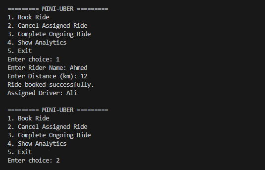
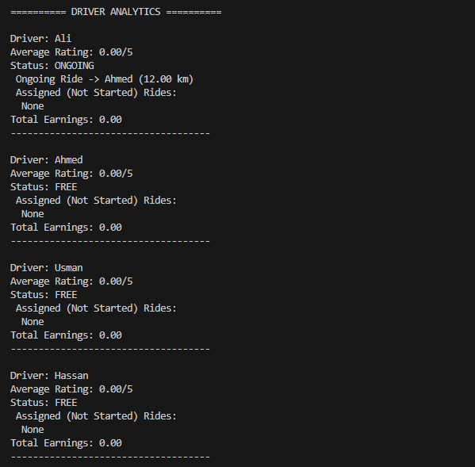
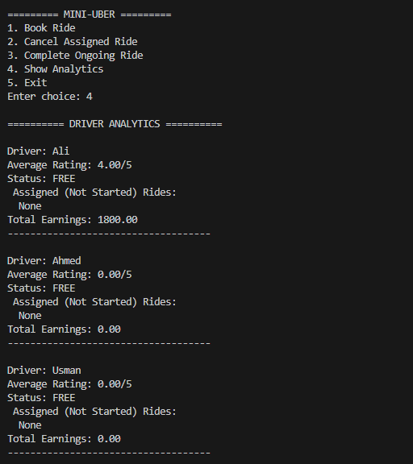
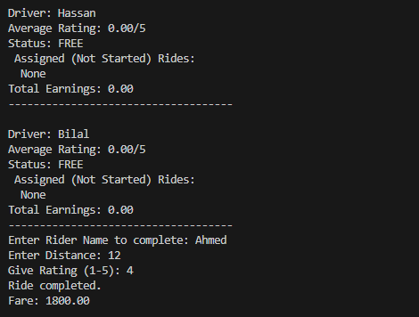
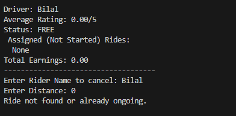
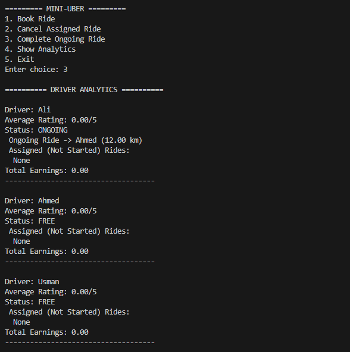
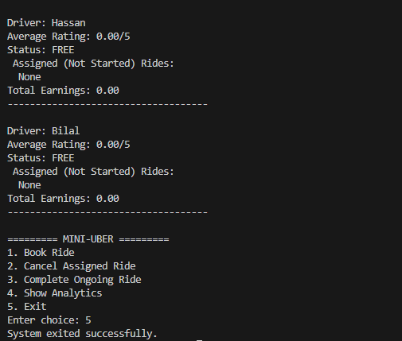

# Mini Uber Ride-Sharing System 🚖

## 📌 Overview
The Mini Uber Ride-Sharing System is a C++ console-based project that simulates a simplified ride-booking platform similar to Uber. It allows riders to book rides, drivers to manage assigned rides, and the system to handle ride completion, cancellations, driver earnings, and ratings.

The project demonstrates the use of Data Structures, Algorithms, and Object-Oriented Programming concepts to manage ride requests efficiently and optimize driver-rider matching.

It is built for educational purposes to simulate real-world ride-sharing operations without live GPS or internet connectivity.

---

## ✨ Features

### 🚕 Ride Booking
- Riders can book a ride by entering their name and travel distance
- System automatically assigns the first available driver
- Each driver can handle up to 3 active rides (1 ongoing + 2 assigned)

### ❌ Cancel Assigned Ride
- Cancel pending assigned rides before they become ongoing
- Prevents cancellation of already ongoing rides

### ✅ Complete Ongoing Ride
- Complete active rides
- Automatically calculate fare based on distance
- Update driver earnings and ride history
- Collect rider rating (1–5)

### 📊 Driver Analytics
- View driver status (Free / Ongoing)
- Display assigned rides queue
- Show total earnings
- Calculate average driver rating

### 💾 File Handling
- Completed rides are stored in a CSV file
- Saves:
  - Ride Number
  - Driver Name
  - Fare
  - Rating

### 🧠 Concepts Used
- Structures (`Ride`, `Driver`)
- Queue Data Structure
- Optional values (`optional`)
- File Handling (`CSV`)
- Driver assignment logic
- Fare calculation algorithm

---

## 🛠️ Tech Stack
- C++
- Data Structures
- Algorithms
- Queue Management
- File Handling
- Console-Based System Design

---

## 📸 Screenshots

### 🏠 Main Menu


### 🚕 Book Ride


### 📊 Driver Analytics


### ✅ Complete Ride


### ❌ Cancel Assigned Ride


### 💾 Completed Rides CSV Output


### ❌ Exit the System


---

## 🚀 How to Run

1. Clone this repository  
2. Open the project in any C++ IDE (CodeBlocks, Dev-C++, Visual Studio, or VS Code)  
3. Compile the code using a C++ compiler  
4. Run the executable file

Example:
```bash
g++ main.cpp -o miniuber
./miniuber
```bash
g++ main.cpp -o miniuber
./miniuber
